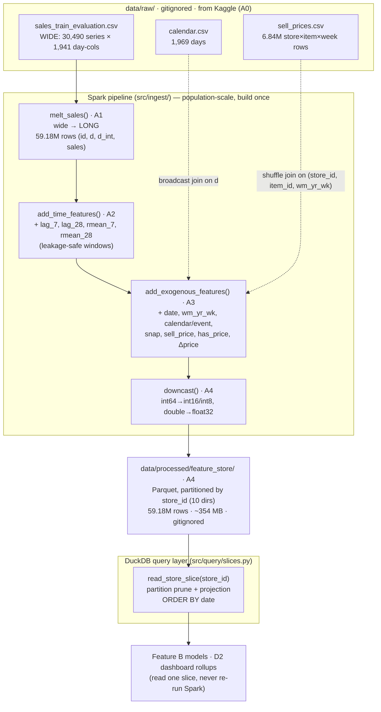

# Data lineage — raw CSVs → DuckDB slice

How the data flows and reshapes across Feature A (A0–A4). Companion to the per-subfeature
prose in [A-ingestion/explainer.md](A-ingestion/explainer.md). Mermaid renders in VS Code
(with a Mermaid extension) and on GitHub.

## Pipeline flow

## Shape at each stage

| Stage | Module | Grain | Rows | Notable columns added |
|---|---|---|---|---|
| Raw sales | `sales_train_evaluation.csv` | one row per **series**, wide | 30,490 | `d_1 … d_1941` |
| A1 melt | `load.melt_sales` | one row per **series-day** | **59,181,090** | `d`, `d_int`, `sales` |
| A2 time | `features.add_time_features` | series-day | 59.18M | `lag_7`, `lag_28`, `rmean_7`, `rmean_28` |
| A3 exog | `exogenous.add_exogenous_features` | series-day | 59.18M | `date`, `wm_yr_wk`, `wday/month/year`, `event_name_1`, `event_type_1`, `is_event`, `snap`, `sell_price`, `has_price`, `price_change_pct` |
| A4 store | `feature_store.build_feature_store` | series-day, downcast, `d` dropped | 59.18M | partitioned by `store_id` |
| Read | `query.read_store_slice` | one store's series-days, date-ordered | ~5.92M / store | — |

Row-level key throughout: **`(id, d_int)`** (a series on a day). `store_id` is a
10-value grouping key, not a unique key.

## Column lineage (where each stored column comes from)

| Stored column | Source | Derivation |
|---|---|---|
| `id`, `item_id`, `dept_id`, `cat_id`, `store_id`, `state_id` | raw sales | identifier columns, carried through |
| `d_int` | A1 | integer parsed from the `d_N` column name (ordering key) |
| `sales` | A1 | the melted daily value |
| `lag_7`, `lag_28` | A2 | `F.lag(sales, k)` per series, ordered by `d_int` |
| `rmean_7`, `rmean_28` | A2 | `avg(sales)` over `rangeBetween(-w, -1)` (excludes today) |
| `date`, `wm_yr_wk`, `wday`, `month`, `year` | calendar | join on `d` |
| `event_name_1`, `event_type_1`, `is_event` | calendar | join on `d`; `is_event = event_name_1 is not null` |
| `snap` | calendar | `snap_CA/TX/WI` collapsed to the series' `state_id` |
| `sell_price` | sell_prices | join on `(store_id, item_id, wm_yr_wk)` |
| `has_price` | sell_prices | `sell_price is not null` (structural-zero signal) |
| `price_change_pct` | sell_prices | `(price − lag(price, 7)) / lag(price, 7)` (week-over-week) |

## The two ordering gates (leakage-adjacent)

1. **A1 → everywhere:** order time by **`d_int`**, never the `d` string (`"d_10" < "d_2"`).
2. **DuckDB reads:** always **`ORDER BY date`** — DuckDB does not guarantee row order, and
   an unordered pull silently scrambles the lags/rolling means built upstream.
